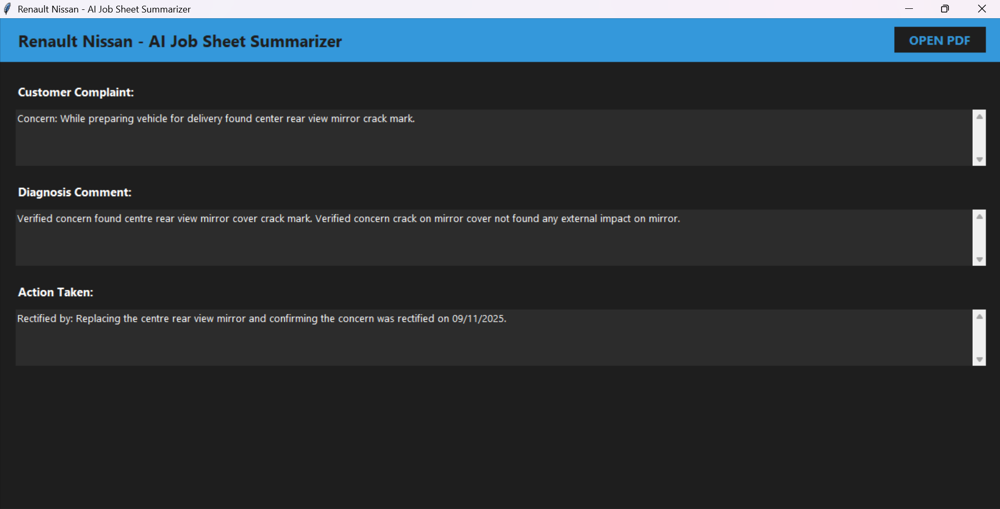
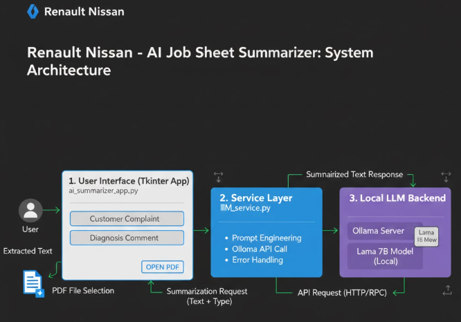

#  Renault Nissan - AI Job Sheet Summarizer

A desktop application built using **Python Tkinter** that utilizes a locally hosted Large Language Model (LLM) via **Ollama** (Llama 7B) to quickly summarize long repair job sheets or customer complaints extracted from PDF documents.

This project demonstrates a clear separation of concerns using a **Service-Oriented Architecture** for maintainability and modularity.

---

## Sample Output

Here is a view of the application running with a sample job sheet processed by the local Llama 7B model.



---

## Application Architecture

The project is structured into three main layers to ensure clean separation of responsibilities: the UI, the Service layer, and the external LLM backend.




* **View/Controller (`ai_summarizer_app.py`):** Handles the Tkinter GUI, user interactions (button clicks), and controls the application flow by calling the service layer.
* **Service Layer (`llm_service.py`):** The core logic handler. It constructs precise prompts, manages communication with the local Ollama server, handles connection errors, and returns clean, processed summaries.
* **LLM Backend (Ollama/Llama 7B):** The locally hosted large language model responsible for performing the AI summarization task.

---

## ✨ Features

* **Modern Dark UI:** Clean, branded dark theme built using Python Tkinter.
* **Local LLM Integration:** Uses the **Ollama** client for fast, private communication with a locally run Llama 7B model.
* **PDF Extraction:** Reads text content directly from PDF files (`.pdf`).
* **Structured Summarization:** Extracts and summarizes key information into three distinct fields:
    1.  Customer Complaint
    2.  Diagnosis Comment
    3.  Action Taken

---

## ⚙️ Prerequisites

You must have the following software installed and configured before running the application:

1.  **Python 3.9+** (Ensure consistency across installations).
2.  **Ollama Server:** Download and install the Ollama server for your operating system.
3.  **Llama 7B Model:** Download the required LLM model via the Ollama command line:
    ```bash
    ollama pull llama2:7b
    ```

## 📦 Installation and Setup

### 1. Project Files

Ensure you have the following two Python files **and your image file** in the same project directory:

1.  `ai_summarizer_app.py`
2.  `llm_service.py`
3.  **`screenshot.png`** (Your output image file)

### 2. Install Python Dependencies

Open your terminal or command prompt and install the necessary Python libraries:

```bash
pip install pypdf ollama
